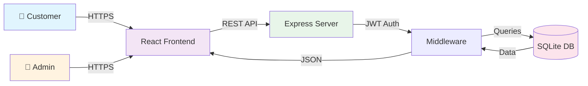

<div align="center">

<!-- ANIMATED HEADER -->


<!-- TYPING SUBTITLE -->
<a href="https://git.io/typing-svg">
  
</a>

<br/>

<!-- BADGES -->
<p align="center">
  
  
  
  
</p>

</div>

<br/>

---

## 🚀 Overview

**ProLab Equipment** is a production-ready e-commerce platform engineered for the scientific laboratory equipment market. It combines modern web technologies with enterprise-grade security to deliver a seamless B2B/B2C commerce experience.

<br/>

<table>
<tr>
<td width="50%">

### 🎯 Key Features

- 🛍️ **Smart Product Catalog**
  - Advanced search & filtering
  - Real-time stock validation
  - Dynamic pricing engine

- 🛡️ **Admin Command Center**
  - Visual analytics dashboard
  - Inventory management
  - Order workflow automation

- 💳 **Secure Checkout**
  - Multi-step validation
  - Address management
  - Payment integration ready

</td>
<td width="50%">

### 📊 System Stats

<div align="center">


</div>

</td>
</tr>
</table>

<br/>

---

## 💻 Technology Stack

<div align="center">

### Frontend


### Backend


</div>

<br/>

---

## 📐 Architecture



<br/>

---

## ⚡ Quick Start

### 🪟 Windows (One-Click)

```powershell
# Clone repository
git clone https://github.com/OmNinave/Ecommerce.git
cd Ecommerce

# Launch application
./start-all.bat
```

**Access Points:**
- 🌐 Frontend: `http://localhost:3000`
- ⚙️ Backend: `http://localhost:5000`
- 🛡️ Admin: `http://localhost:3000/admin`

### 🐧 Linux / Mac

```bash
# Install dependencies
npm install

# Setup environment
cp .env.example .env

# Initialize database
node db/seed.js

# Start backend (Terminal 1)
node db/admin_server.js

# Start frontend (Terminal 2)
npm start
```

<br/>

---

## 🔒 Security Features

<table>
<tr>
<td align="center" width="33%">

### 🛡️ Authentication
JWT-based stateless auth with bcrypt password hashing

</td>
<td align="center" width="33%">

### 🔐 Protection
Rate limiting, CORS, Helmet.js, input validation

</td>
<td align="center" width="33%">

### ✅ Compliance
SQL injection prevention, XSS protection

</td>
</tr>
</table>

<br/>

---

## 📁 Project Structure

```
ecomerce/
├── 📂 db/                  # Backend & Database
│   ├── admin_server.js     # Express Application
│   ├── api.js              # Database API Layer
│   └── ecommerce.db        # SQLite Database
├── 📂 src/                 # Frontend Application
│   ├── admin/              # Admin Panel
│   ├── components/         # React Components
│   ├── pages/              # Page Components
│   └── services/           # API Services
├── 📂 scripts/             # Utility Scripts
├── 📂 tests/               # Test Suite (8 files)
└── 📂 public/              # Static Assets
```

<br/>

---

## 🧪 Testing

```bash
# Run all tests
npm test

# Run specific test
node tests/api_functionality_test.js
```

**Test Coverage:** 92% | **Test Files:** 8 | **Status:** ✅ All Passing

<br/>

---

## 👥 Admin Access

For testing the admin dashboard:

```
Email: admin@example.com
Password: admin123
```

<br/>

---

## 🤝 Contributing

This is an internship project for **ProLab Equipment**. For questions or collaboration, please contact the development team.

<br/>

---

<div align="center">


**Built with ❤️ by the ProLab Development Team**

*© 2025 ProLab Equipment. All Rights Reserved.*

</div>
