```mermaid
%%{init: {'theme': 'dark', 'themeVariables': { 'primaryColor': '#00F0FF', 'edgeLabelBackground':'#000000', 'tertiaryColor': '#0d1117'}}}%%
graph TD
    User((👤 USER)) -->|HTTPS| UI[💻 FRONTEND]
    Admin((🕵️ ADMIN)) -->|HTTPS| UI
    
    subgraph CORE [🔥 SYSTEM CORE]
        UI -->|JSON| API[⚡ API GATEWAY]
        API -->|JWT| Auth[🛡️ SECURITY]
        Auth -->|Query| DB[(💾 DATA VAULT)]
    end
    
    DB -->|Analytics| Dashboard[📊 DASHBOARD]
    
    style UI fill:#0d1117,stroke:#00F0FF,stroke-width:2px
    style API fill:#0d1117,stroke:#BD00FF,stroke-width:2px
    style DB fill:#0d1117,stroke:#00FF00,stroke-width:2px
    style Auth fill:#0d1117,stroke:#FF0000,stroke-width:2px
```

<!-- 
  🚀 PROLAB EQUIPMENT - HYPER-REALISTIC README 
  Powered by Advanced SVG Generators
-->

<!-- HEADER: GLOWING NEON TEXT -->

<!-- SUBTITLE -->

 

<!-- BADGES: HOLOGRAPHIC STYLE -->

  
  
  
  

 

<!-- ISOMETRIC CITY ANIMATION -->
<picture>
  <source media="(prefers-color-scheme: dark)" srcset="https://raw.githubusercontent.com/platane/platane/master/public/github-isometric-2019.svg">
  
</picture>

 

<!-- DASHBOARD WITH ROUNDED CORNERS & GLOW -->
<table width="100%" style="border: none; background: #000000;">
  <tr>
    <td width="60%" style="border: 1px solid #333; border-radius: 20px; background: #0d1117; padding: 20px; box-shadow: 0 0 10px #00F0FF20;">
      <h2 align="center">⚡ SYSTEM CORE</h2>
       
      

        <!-- CYBERPUNK DIVIDER -->
        
      

       
      

        <b>ProLab Equipment</b> is a high-performance commerce engine.
          
        > 🚀 <b>Real-time</b> Inventory Tracking 
        > 🔠<b>RBAC</b> Admin Security Layer 
        > 💠<b>Dynamic</b> Currency Engine (INR/USD) 
        > 📱 <b>Glassmorphism</b> UI / UX Design
      

    </td>
    <td width="40%" style="border: 1px solid #333; border-radius: 20px; background: #0d1117; padding: 20px; box-shadow: 0 0 10px #BD00FF20;">
      <h2 align="center">📊 LIVE METRICS</h2>
       
      

        <!-- TERMINAL -->
        +Database:+CONNECTED;>+API+Gateway:+ONLINE;>+Security:+ENCRYPTED;>+Uptime:+99.99%25" alt="Terminal" />
      

    </td>
  </tr>
</table>

 

<!-- TECH STACK -->
<h2 align="center">🧬 TECHNOLOGY MATRIX</h2>

  

 

<!-- ARCHITECTURE - MERMAID DIAGRAM (FIXED) -->
<h2 align="center">📐 NEURAL NETWORK (Architecture)</h2>

 

<!-- INSTALLATION -->
<h2 align="center">🚀 DEPLOYMENT PROTOCOLS</h2>

<table width="100%" style="border-spacing: 20px;">
<tr>
<td width="50%" style="border: 1px solid #333; border-radius: 20px; background: #0d1117; padding: 20px; box-shadow: 0 0 15px #00F0FF10;">

  <h3>🪟 WINDOWS PROTOCOL</h3>
  
    
  <code>./start-all.bat</code>

</td>
<td width="50%" style="border: 1px solid #333; border-radius: 20px; background: #0d1117; padding: 20px; box-shadow: 0 0 15px #BD00FF10;">

  <h3>🐧 UNIX PROTOCOL</h3>
  
    
  <code>npm start</code>

</td>
</tr>
</table>

 

<!-- FOOTER -->

  

