```mermaid
%%{init: {'theme': 'dark', 'themeVariables': { 'primaryColor': '#00F0FF', 'edgeLabelBackground':'#000000', 'tertiaryColor': '#0d1117'}}}%%
graph TD
    User((👤 USER)) -->|HTTPS| UI[💻 FRONTEND]
    Admin((🕵️ ADMIN)) -->|HTTPS| UI
    
    subgraph CORE [🔥 SYSTEM CORE]
        UI -->|JSON| API[⚡ API GATEWAY]
        API -->|JWT| Auth[🛡️ SECURITY]
        Auth -->|Query| DB[(💾 DATA VAULT)]
    end
    
    DB -->|Analytics| Dashboard[📊 DASHBOARD]
    
    style UI fill:#0d1117,stroke:#00F0FF,stroke-width:2px
    style API fill:#0d1117,stroke:#BD00FF,stroke-width:2px
    style DB fill:#0d1117,stroke:#00FF00,stroke-width:2px
    style Auth fill:#0d1117,stroke:#FF0000,stroke-width:2px
```

<!-- 
  🚀 PROLAB EQUIPMENT - SVG CARD EDITION
  Bypassing GitHub CSS limitations using rendered SVGs
-->

<!-- HEADER: STATIC GLOWING NEON (Capsule Render with specific settings) -->

 

<!-- BADGES: NEON STYLE -->

  
  
  
  

 

<!-- ISOMETRIC CITY (Kept because it looks cool) -->

  

<!-- FEATURE CARDS (Using Readme-Stats to simulate UI Cards) -->
<!-- These have built-in rounded corners and themes -->

<table border="0">
  <tr>
    <td width="50%" align="center">
      
       
      <b>⚡ SYSTEM CORE</b>
    </td>
    <td width="50%" align="center">
      
       
      <b>📊 LIVE METRICS</b>
    </td>
  </tr>
</table>

 

<!-- TECH STACK -->
<h2>🧬 TECHNOLOGY MATRIX</h2>

  

<!-- ARCHITECTURE DIAGRAM (Mermaid is still the best for this) -->
<h2>📐 NEURAL NETWORK</h2>
<pre>

</pre>

 

<!-- DEPLOYMENT SECTION -->
<h2>🚀 DEPLOYMENT PROTOCOLS</h2>

<table width="100%">
<tr>
<td width="50%" align="center">
  
   
  <code>./start-all.bat</code>
</td>
<td width="50%" align="center">
  
   
  <code>npm start</code>
</td>
</tr>
</table>

 

<!-- FOOTER -->

