<div align="center">

<!-- ANIMATED HEADER -->


<br/>

<!-- TYPING ANIMATION -->
<a href="https://git.io/typing-svg">
  
</a>

<br/><br/>

<!-- BADGES -->
<p align="center">
  
  
  
  
</p>

<br/>

<!-- REPOSITORY STATS -->
<p align="center">
  
  
  
  
</p>

</div>

<br/><br/>

<!-- ANIMATED DIVIDER -->


<br/>

## 🎯 Project Overview

**ProLab Equipment** is a production-ready, full-stack e-commerce platform engineered for the scientific laboratory equipment market. Combining cutting-edge web technologies with enterprise-grade security, it delivers a seamless B2B/B2C commerce experience.

<br/>

<div align="center">

### ✨ Core Features

<table>
<tr>
<td align="center" width="33%">

### 🛍️ Smart Catalog

<br/><br/>
Advanced search & filtering<br/>
Real-time stock validation<br/>
Dynamic pricing (INR/USD)<br/>
Category-based navigation

</td>
<td align="center" width="33%">

### 🛡️ Admin Center

<br/><br/>
Visual analytics dashboard<br/>
Complete inventory control<br/>
Order workflow automation<br/>
User management system

</td>
<td align="center" width="33%">

### 💳 Secure Checkout

<br/><br/>
Multi-step validation<br/>
Address management<br/>
Payment integration ready<br/>
Email notifications

</td>
</tr>
</table>

</div>

<br/>

<div align="center">

### 📊 System Metrics


</div>

<br/><br/>

<!-- ANIMATED DIVIDER -->


<br/>

## 💻 Technology Stack

<div align="center">

<h3>Frontend</h3>


<h3>Backend</h3>


<h3>Tools</h3>


<br/><br/>

### 📦 Key Dependencies


</div>

<br/>

<details>
<summary><b>📦 Complete Tech Stack</b></summary>

<br/>

| Layer | Technologies |
|:------|:-------------|
| **Frontend** | React 18, JavaScript ES6+, HTML5, CSS3, Tailwind CSS, Recharts |
| **Backend** | Node.js 18, Express.js, JWT, Bcrypt, Nodemailer |
| **Database** | SQLite3, Better-SQLite3 |
| **Security** | Helmet.js, CORS, Rate Limiting, Input Validation |
| **DevOps** | Git, npm, Vercel, Netlify, Heroku |

</details>

<br/><br/>

<!-- ANIMATED DIVIDER -->


<br/>

## 📐 System Architecture

```mermaid
%%{init: {'theme':'dark', 'themeVariables': {'primaryTextColor':'#00F0FF', 'secondaryTextColor':'#00F0FF', 'tertiaryTextColor':'#00F0FF', 'textColor':'#00F0FF'}}}%%
graph TB
    subgraph Client["🌐 CLIENT LAYER"]
        A[👤 Customer]
        B[🔐 Admin]
    end
    
    subgraph Frontend["💻 FRONTEND"]
        C[React App<br/>Port 3000]
    end
    
    subgraph Backend["⚙️ BACKEND"]
        D[Express Server<br/>Port 5000]
        E[JWT Auth]
        F[API Routes]
    end
    
    subgraph Data["💾 DATA LAYER"]
        G[(SQLite DB)]
    end
    
    A -->|HTTPS| C
    B -->|HTTPS| C
    C -->|REST API| D
    D --> E
    E --> F
    F -->|SQL Queries| G
    G -->|JSON| F
    F -->|Response| C
    
    style Client fill:#e1f5fe,stroke:#01579b,stroke-width:2px,color:#000000
    style Frontend fill:#f3e5f5,stroke:#4a148c,stroke-width:2px,color:#000000
    style Backend fill:#e8f5e9,stroke:#1b5e20,stroke-width:2px,color:#000000
    style Data fill:#fff3e0,stroke:#e65100,stroke-width:2px,color:#000000
```



<br/><br/>

<!-- ANIMATED DIVIDER -->


<br/>

## ⚡ Quick Start

<table>
<tr>
<td width="50%" valign="top">

### 🪟 Windows (Recommended)

```powershell
# Clone repository
git clone https://github.com/OmNinave/Ecommerce.git

# Navigate to folder
cd Ecommerce

# One-click launch
./start-all.bat
```

**✅ Access Points:**
- 🌐 Frontend: `http://localhost:3000`
- ⚙️ Backend: `http://localhost:5000`  
- 🛡️ Admin: `http://localhost:3000/admin`

</td>
<td width="50%" valign="top">

### 🐧 Linux / Mac

```bash
# Clone repository
git clone https://github.com/OmNinave/Ecommerce.git

# Navigate to folder
cd Ecommerce

# Install dependencies
npm install

# Setup environment
cp .env.example .env

# Initialize database
node db/seed.js

# Start backend (Terminal 1)
node db/admin_server.js

# Start frontend (Terminal 2)
npm start
```

</td>
</tr>
</table>

<br/>

<div align="center">

### 🔑 Default Admin Credentials

```yaml
Email: admin@example.com
Password: admin123
```

**⚠️ Change these in production!**

</div>

<br/><br/>

<!-- ANIMATED DIVIDER -->


<br/>

## 🔒 Security Features

<div align="center">

| Feature | Implementation | Status |
|:--------|:---------------|:-------|
| **Authentication** | JWT + Bcrypt | ✅ Active |
| **Rate Limiting** | Express Rate Limit | ✅ Active |
| **Input Validation** | Express Validator | ✅ Active |
| **SQL Injection** | Parameterized Queries | ✅ Protected |
| **XSS Protection** | Helmet.js | ✅ Active |
| **CORS** | Configured Origins | ✅ Active |
| **Password Hashing** | Bcrypt (10 rounds) | ✅ Active |
| **Session Management** | Secure JWT Tokens | ✅ Active |

</div>

<br/><br/>

<!-- ANIMATED DIVIDER -->


<br/>

## 📁 Project Structure

<div align="center">

| Directory | Description | Key Files |
|:----------|:------------|:----------|
| **🗄️ db/** | Backend & Database Layer | `admin_server.js` (101KB), `api.js` (35KB), `ecommerce.db` (905KB), `checkout_routes.js`, `emailService.js`, `middleware/` |
| **⚛️ src/** | React Frontend | `admin/` (5 files), `components/` (20 files), `pages/` (19 files), `services/`, `context/` |
| **🛠️ scripts/** | Utility Scripts | `add_admin.js`, `populate_product_data.js`, + 7 more utility files |
| **🧪 tests/** | Test Suite (92% coverage) | `api_functionality_test.js`, `integration_logic_tests.js`, + 6 more test files |
| **🌐 public/** | Static Assets | HTML, robots.txt, redirects |

</div>

<br/><br/>

<!-- ANIMATED DIVIDER -->


<br/>

## 🧪 Testing

<div align="center">

| Metric | Value | Status |
|:-------|:------|:-------|
| **Test Coverage** | 92% | ✅ Excellent |
| **Test Files** | 8 | ✅ Comprehensive |
| **Performance** | 98/100 | ✅ Optimized |
| **Security Grade** | A+ | ✅ Hardened |
| **API Tests** | 45+ | ✅ Passing |
| **Integration Tests** | 30+ | ✅ Passing |

</div>

<br/>

```bash
# Run all tests
npm test

# Run specific test suites
node tests/api_functionality_test.js
node tests/integration_logic_tests.js
node tests/P0_auth_and_order_tests.js

# Run performance tests
node tests/lightweight_performance_test.js
```

<br/><br/>

<!-- ANIMATED DIVIDER -->


<br/>

## 🚀 API Endpoints

<details>
<summary><b>📡 View Complete API Reference</b></summary>

<br/>

### Authentication
```
POST   /api/auth/register          - Register new user
POST   /api/auth/login             - User login
POST   /api/auth/logout            - User logout
GET    /api/auth/verify            - Verify JWT token
```

### Products
```
GET    /api/products               - Get all products
GET    /api/products/:id           - Get product by ID
POST   /api/products               - Create product (Admin)
PUT    /api/products/:id           - Update product (Admin)
DELETE /api/products/:id           - Delete product (Admin)
```

### Orders
```
GET    /api/orders                 - Get user orders
GET    /api/orders/:id             - Get order by ID
POST   /api/orders                 - Create new order
PUT    /api/orders/:id/status      - Update order status (Admin)
```

### Cart
```
GET    /api/cart                   - Get user cart
POST   /api/cart/add               - Add item to cart
PUT    /api/cart/update            - Update cart item
DELETE /api/cart/remove/:id        - Remove cart item
```

### Admin
```
GET    /api/admin/dashboard        - Get dashboard stats
GET    /api/admin/users            - Get all users
GET    /api/admin/analytics        - Get analytics data
```

</details>

<br/><br/>

<!-- ANIMATED DIVIDER -->


<br/>

## 🎨 Features Showcase

<div align="center">

### 🛒 Customer Features

<table>
<tr>
<td align="center" width="25%">

**🔍 Smart Search**<br/>
Instant product search<br/>
with autocomplete

</td>
<td align="center" width="25%">

**🏷️ Filtering**<br/>
Category, price,<br/>
and availability filters

</td>
<td align="center" width="25%">

**💱 Currency**<br/>
Real-time INR/USD<br/>
conversion

</td>
<td align="center" width="25%">

**📦 Tracking**<br/>
Order status<br/>
updates

</td>
</tr>
</table>

### 🛡️ Admin Features

<table>
<tr>
<td align="center" width="25%">

**📊 Analytics**<br/>
Sales trends &<br/>
revenue charts

</td>
<td align="center" width="25%">

**📦 Inventory**<br/>
Stock management<br/>
& alerts

</td>
<td align="center" width="25%">

**👥 Users**<br/>
Customer data<br/>
management

</td>
<td align="center" width="25%">

**📧 Emails**<br/>
Automated order<br/>
notifications

</td>
</tr>
</table>

</div>

<br/><br/>

<!-- ANIMATED DIVIDER -->


<br/>

## 🤝 Get Involved

<div align="center">

<table>
<tr>
<td align="center" width="33%">

### ⭐ Star This Repo
Show your support by<br/>starring the project<br/><br/>
[](https://github.com/OmNinave/Ecommerce/stargazers)

</td>
<td align="center" width="33%">

### 🐛 Report Issues
Found a bug?<br/>Let us know!<br/><br/>
[](https://github.com/OmNinave/Ecommerce/issues)

</td>
<td align="center" width="33%">

### 💡 Suggest Features
Have ideas?<br/>We'd love to hear!<br/><br/>
[](https://github.com/OmNinave/Ecommerce/discussions)

</td>
</tr>
</table>

</div>

<br/><br/>

<!-- ANIMATED DIVIDER -->


<br/>

## 📚 Documentation

<div align="center">

| Document | Description |
|:---------|:------------|
| [Installation Guide](./DOCS/START_HERE.md) | Complete setup instructions |
| [API Reference](./DOCS/API_QUICK_REFERENCE.md) | Detailed API documentation |
| [Security Features](./DOCS/SECURITY_FEATURES.md) | Security implementation details |
| [Testing Guide](./DOCS/TESTING_GUIDE.md) | How to run and write tests |
| [Deployment Guide](./DOCS/INTERNSHIP_SUBMISSION_GUIDE.md) | Production deployment steps |

</div>

<br/><br/>

<!-- ANIMATED DIVIDER -->


<br/>

## 📝 Contributing

This is an internship project for **ProLab Equipment**. For questions or collaboration, please contact the development team.

<br/><br/>

<!-- FOOTER -->
<div align="center">


<br/>

**⭐ Built with ❤️ by the ProLab Development Team ⭐**

*© 2025 ProLab Equipment. All Rights Reserved.*

<br/>

[](https://github.com/OmNinave)
[](https://github.com/Lavish911)
[](https://linkedin.com)
[](https://portfolio.com)

<br/>

### 🌟 If you found this project helpful, please give it a star! 🌟

</div>
